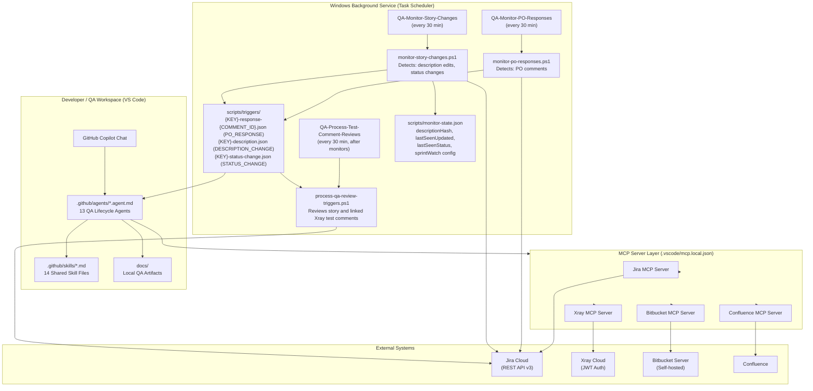
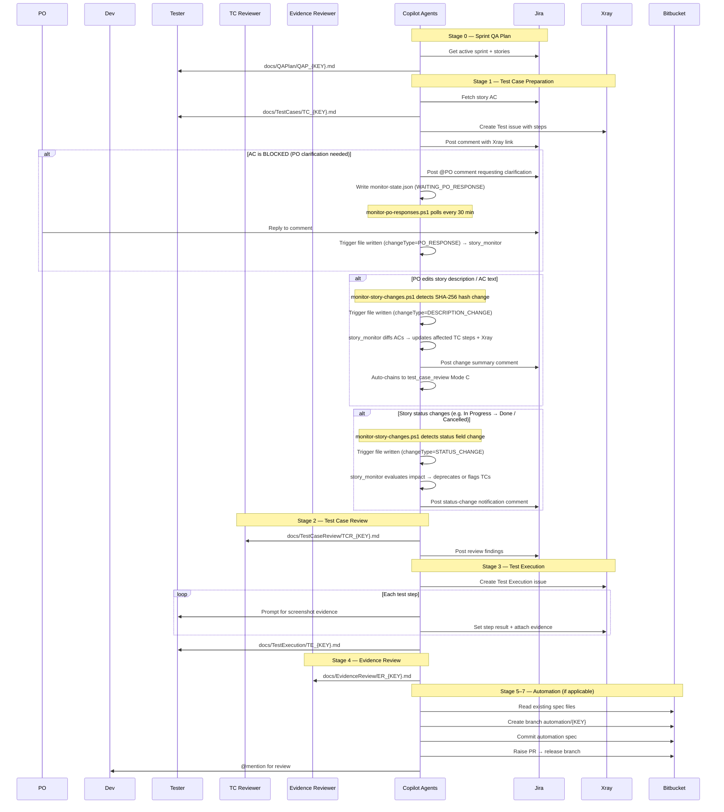
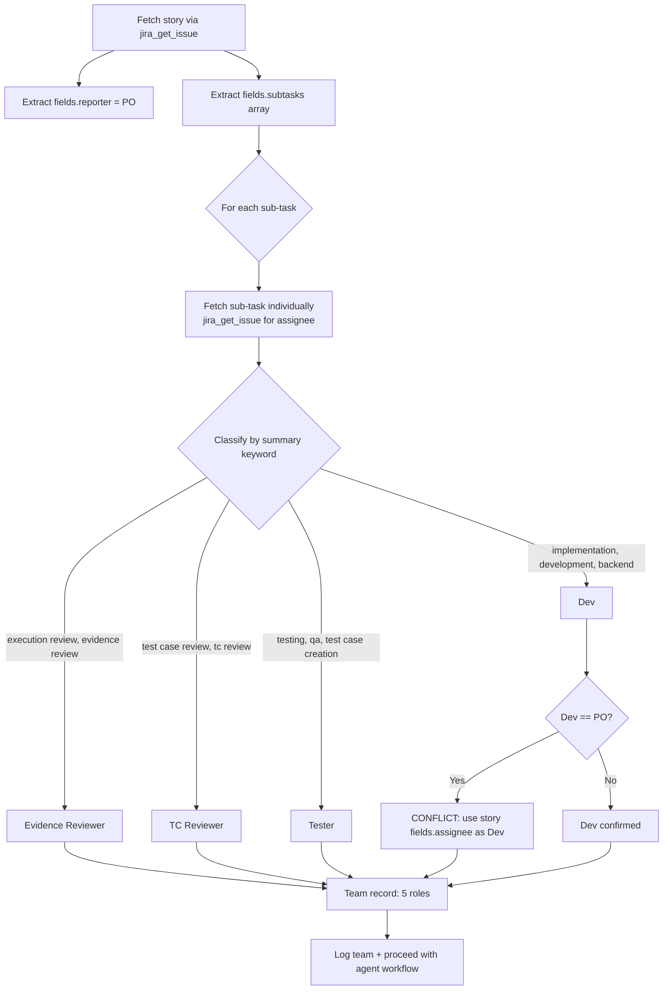
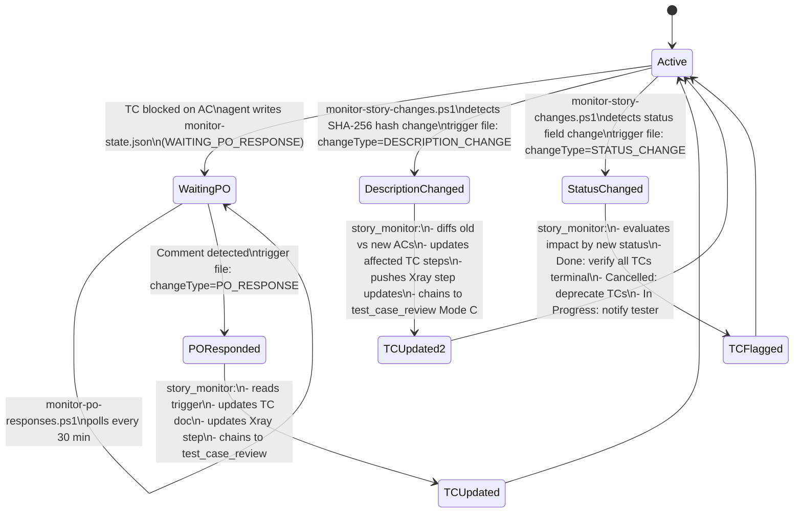

# Agentic AI QA Framework — Architecture & Design

> **Document type**: Framework Architecture, Design Reference & User Guide
> **Audience**: QA Engineers, Developers, Tech Leads, Engineering Managers
> **Last updated**: 2026-07-21

---

## Table of Contents

1. [Executive Summary](#1-executive-summary)
2. [Problem Statement](#2-problem-statement)
3. [Architecture Overview](#3-architecture-overview)
4. [Component Design](#4-component-design)
5. [QA Lifecycle — Stage by Stage](#5-qa-lifecycle--stage-by-stage)
6. [Team Auto-Discovery Pattern](#6-team-auto-discovery-pattern)
7. [Xray Integration Design](#7-xray-integration-design)
8. [Bitbucket Automation Integration](#8-bitbucket-automation-integration)
9. [PO Response Monitor](#9-po-response-monitor)
10. [How to Set Up (New Project)](#10-how-to-set-up-new-project)
11. [How to Use (Day-to-Day)](#11-how-to-use-day-to-day)
12. [Use Cases Covered](#12-use-cases-covered)
13. [Design Decisions & Constraints](#13-design-decisions--constraints)
14. [Security Model](#14-security-model)
15. [Story Change Monitor — Algorithm](#15-story-change-monitor--algorithm)

---

## 1. Executive Summary

The **Agentic AI QA Framework** replaces manual, repetitive QA administrative work with a suite of GitHub Copilot agents that automate the full QA lifecycle — from test case creation through automation code review — for any software project using Jira, Xray, and Bitbucket.

**Key outcomes:**

| Metric | Before | After |
|--------|--------|-------|
| Time to produce a test case document | 2–4 hours per story | < 5 minutes |
| Xray test creation | Manual, error-prone | Automatic, step-accurate |
| PO clarification loop | Manual email/comment tracking | Automated polling + auto-resume |
| Automation code PR | Manual branch + PR creation | Automatic branch, commit, PR |
| Evidence review | Manual screenshot audit | Guided, structured per-step review |
| Framework setup for new project | Days of config | Single PowerShell command |

---

## 2. Problem Statement

Traditional QA processes for Jira-backed software projects suffer from:

1. **Manual test case authoring** — QA engineers spend significant time writing, formatting, and uploading test cases to Xray
2. **Context switching** — moving between Jira, Xray, Bitbucket, and VS Code introduces friction and errors
3. **Inconsistent quality** — test cases vary in depth and structure depending on the author
4. **Blocked cycle detection** — when a TC is blocked on PO clarification, no automated mechanism prompts the team
5. **Portability gap** — QA tooling configured for one project cannot easily be reused for another
6. **Automation gap** — automation code creation and review is disconnected from test case documentation

---

## 3. Architecture Overview



### Layered Architecture

| Layer | Technology | Role |
|-------|-----------|------|
| **Presentation** | GitHub Copilot Chat (VS Code) | User interaction — natural language |
| **Agent** | `.github/agents/*.agent.md` | Workflow orchestration — step-by-step instructions for Copilot |
| **Skill** | `.github/skills/*.md` | Shared domain knowledge loaded by agents |
| **Integration** | MCP Servers (`.vscode/mcp.json`) | API connectivity to Jira, Xray, Bitbucket, Confluence |
| **Persistence** | `docs/` folder | Local QA artifact storage (markdown files) |
| **Background** | Windows Task Scheduler | Autonomous PO response polling |

---

## 4. Component Design

### 4.1 Agent Files (`.github/agents/`)

Each agent is a markdown file with YAML frontmatter declaring:
- `model` — the Copilot model to use
- `tools` — allowed MCP tools (e.g., `jira/*`, `xray/*`, `bitbucket/*`)
- `instructions` — path to skill files to load

The agent body contains numbered steps that Copilot executes sequentially. Agents are stateful within a conversation session and produce both local markdown artifacts and remote Jira/Xray/Bitbucket updates.

**Agent inventory:**

| Agent file | Purpose |
|-----------|---------|
| `sprint_story_qa_plan.agent.md` | Generates QA plan for all stories in the active sprint |
| `test_case_preparation.agent.md` | Creates test cases from story AC; uploads to Xray; enforces context-first clarification gate (impacted APIs + design refs + code evidence) |
| `test_case_review.agent.md` | Reviews TC coverage against AC; maps findings to impacted APIs/changed files and design references; owns Xray test-comment assessment, evidence requests, and test-level review verdicts |
| `test_case_execution.agent.md` | Guides manual execution step-by-step; attaches evidence |
| `test_case_evidence_review.agent.md` | Validates execution screenshots and outcomes |
| `automation_code_preparation.agent.md` | Generates Protractor automation spec from test cases |
| `automation_code_review.agent.md` | Reviews automation code; raises Bitbucket PR |
| `automation_run_publish.agent.md` | Runs automation suite; publishes results to Jira |
| `story_monitor.agent.md` | Processes trigger files from both monitors; routes by `changeType`: `PO_RESPONSE` (resumes blocked TC cycle; delegates linked-Xray comments to `test_case_review` Mode D), `DESCRIPTION_CHANGE` (diffs ACs, updates TC doc + Xray steps, chains to review), `STATUS_CHANGE` (notifies team, deprecates/flags TCs), `SPRINT_CHANGE` (creates a fresh TE and relinks story/test to the new sprint) |
| `impact_analysis.agent.md` | Generates impact analysis for code changes |
| `root_cause_analysis.agent.md` | Generates 5-Why RCA documents for defects |
| `code_review_basic_ondisk.agent.md` | Local code review against target branch |
| `code_review_basic_bitbucket.agent.md` | Bitbucket PR code review with inline comments |

### 4.2 Skill Files (`.github/skills/`)

Skills are shared markdown documents loaded by agents at runtime. They encode domain knowledge that doesn't change per story:

| Skill file | Purpose |
|-----------|---------|
| `story-team-discovery.md` | How to discover the 5-person team from sub-tasks |
| `xray-integration.md` | Xray API patterns, JWT auth, test/execution creation |
| `automation-repository-config.md` | Bitbucket coordinates, branches, local repo path *(project-specific)* |
| `qa-artifact-naming.md` | Document naming conventions |
| `qa-prioritization-framework.md` | Test priority rules |
| `story-execution-readiness.md` | Criteria for when a story is ready for testing |
| `evidence-quality-standards.md` | Screenshot/evidence acceptance rules |
| `automation-code-standards.md` | Protractor code style, folder structure |
| `defect-creation-pattern.md` | How to raise Jira Defects from failing steps |
| `jira-sprint-query.md` | Board → Sprint → Story discovery workflow |
| `code-review-criteria.md` | Code quality checklist for reviews |
| `5-why-methodology.md` | RCA methodology reference || `test-environment-compatibility.md` | Cross-browser, cross-OS, cross-DB compatibility matrix, tier-based coverage, per-env Xray executions, evidence and defect tagging rules |
| `test-execution-sprint-linking.md` | Sprint TE presence gate — auto-creates sprint Test Execution, notifies PO/PM via Jira comment and Teams webhooks (CID Scurm Team Chat + AC1 Daily Stand-up), bulk-adds all active sprint tests; transitions TE to `In Dev` before execution; enforces hard block in `test_case_execution` Step 0B if the story is not on the current sprint board or the test is not linked to a sprint TE |
| `smoke-prerequisite-gate.md` | Requires smoke then smoke-install as the first two steps for stories mentioning driver, Linux/Windows update, add-on, OpenLab CDS, or KVM; execution stops if either suite fails |
### 4.3 Scripts (`scripts/`)

| Script | Purpose |
|-------|---------|
| `setup-qa-framework.ps1` | Bootstrapper — one-command setup for new projects |
| `xray-api.ps1` | Xray REST API helpers (reusable functions) |
| `monitor-po-responses.ps1` | Scheduled payload — polls Jira for new **comments** on blocked issues, scoped to active sprint non-terminal Story issues; when configured, also watches linked test comment streams (`qnWatchIssue` / `xrayTestKey`) and records the source/resolution issue so `test_case_review` can resolve test-level feedback on the Xray Test |
| `process-qa-review-triggers.ps1` | Scheduled processor — classifies linked-Xray test comments with local Ollama using story, TC, and Xray-step evidence; writes `TCR_{TEST-KEY}_Comments.md`, posts a verdict/evidence request on the Xray Test, and never edits Xray steps |
| `monitor-story-changes.ps1` | Scheduled payload — polls Jira for **description/AC edits**, **status changes**, and sprint carry-over on active sprint non-terminal Story issues; emits `SPRINT_CHANGE` for carry-over stories, ignores out-of-sprint legacy entries, excludes legacy trigger types from active processing, and auto-cleans triggers for terminal-status stories |
| `process-qa-agent-triggers.ps1` | Scheduled handoff worker — verifies current-sprint TE/Xray-run readiness through `xray-api.ps1`, requires and invokes a configured automation runner, syncs manifest-backed automated step results/evidence to Xray, and records blocked handoffs when the runner or sync fails |
| `automation-runner.ps1` | Local automation runner — chains the Bitbucket Protractor smoke-install flow and OLAC-7566 feature spec, requires `IP_ADDRESS`, `OLS_NAME`, and `OLD_CID_NAME` for install/upgrade evidence, and writes the evidence manifest consumed by Xray sync |
| `build-agent-activity-log.ps1` | Dashboard data builder — scans QA artifacts and trigger files to generate `scripts/agent-activity-log.json` with `currentSprint`, `changeLogUpdates`, and `pendingUserActions` for the monitoring dashboard |
| `setup-task-scheduler.ps1` | Registers the QA Automation Orchestrator as a scheduled task |
| `setup-story-monitor-scheduler.ps1` | Registers **both** QA monitors (`QA-Monitor-PO-Responses` + `QA-Monitor-Story-Changes`) as scheduled tasks; self-elevates via UAC if not admin |
| `monitor-health-check.ps1` | Verifies both monitors, `QA-Process-Test-Comment-Reviews`, stale triggers, and Jira connectivity; sends Event Log and Jira notifications for failures |

**VS Code Tasks** (`.vscode/tasks.json`):

| Task label | Action |
|-----------|--------|
| `QA: Run All Monitors Now` | Runs both monitors immediately (manual trigger) |
| `QA: Run Monitors + Build Activity Log` | Runs both monitors and then rebuilds `scripts/agent-activity-log.json` for dashboard sections |
| `QA: Seed Story Change Baselines` | Seeds description hashes on first run |
| `QA: Setup Scheduled Tasks (run as Admin)` | Launches the scheduler setup script elevated |
| `QA: Build Agent Activity Log` | Rebuilds `scripts/agent-activity-log.json` for dashboard Change Log + Pending User Actions sections |

Dashboard scope behavior:
- Default scope is Current Sprint, auto-derived from `currentSprint` in `scripts/agent-activity-log.json` (or latest timestamped sprint fallback).
- Optional scope toggle allows switching to All History without regenerating data.

### 4.4 Document Templates (`docs/_TEMPLATES/`)

Structured markdown templates that agents populate:

| Template | Produced by / used by |
|---------|----------------------|
| `QASprintPlanTemplate.md` | `sprint_story_qa_plan` |
| `TestCasePlanTemplate.md` | `test_case_preparation` |
| `TestCaseExecutionTemplate.md` | `test_case_execution` |
| `ImpactAnalysisTemplate.md` | `impact_analysis` |
| `EnvironmentMatrixTemplate.md` | Configured once per project; read by `test_case_preparation`, `test_case_execution`, `test_case_review` |

---

## 5. QA Lifecycle — Stage by Stage



### Stage Gate Rules

| From Stage | Condition to advance |
|-----------|---------------------|
| 0 → 1 | Story has AC in Jira |
| 1 → 2 | Xray Test created; all ACs mapped |
| 2 → 3 | TC Reviewer approved (no Critical/High findings) |
| 3 → 4 | All Xray steps have Pass/Fail result + evidence |
| 4 → 5 | Evidence Reviewer approved |
| 5 → 6 | Automation code generated; Dev input resolved |
| 6 → 7 | PR merged to release branch |

---

## 6. Team Auto-Discovery Pattern

Every agent begins with **Team Discovery (Step 1a)** — automatically finding the 5 people responsible for the story, with zero user input.



**Priority keyword table** (most-specific first):

| Priority | Role | Keywords in sub-task summary |
|----------|------|------------------------------|
| 1 | Evidence Reviewer | `execution review`, `evidence review`, `test case execution review` |
| 2 | TC Reviewer | `test case review`, `tc review`, `test review` — NOT `execution` |
| 3 | Dev | `implementation`, `development`, `backend`, `frontend`, `coding`, `engineering` |
| 4 | Tester | `test case creation`, `testing`, `qa`, `quality assurance`, `verification` |

**Fallback chain:**
- TC Reviewer not found → use Tester
- Evidence Reviewer not found → use TC Reviewer
- Dev == PO (conflict) → use story `fields.assignee` as Dev

---

## 7. Xray Integration Design

The framework uses **Xray Cloud REST API** with JWT authentication:

```
POST https://us.xray.cloud.getxray.app/api/v2/authenticate
→ returns JWT token (valid 24h)

POST https://us.xray.cloud.getxray.app/api/v2/graphql
→ create Test issues, add steps, set results, attach evidence
```

**`scripts/xray-api.ps1`** provides reusable functions:

| Function | Purpose |
|----------|---------|
| `New-XrayTest` | Create Xray Test issue in Jira |
| `New-XrayTestExecution` | Create Test Execution and link to Test |
| `Get-XrayTestRunId` | Retrieve test run ID for a test within an execution |
| `Get-XrayTestRunSteps` | List all steps with their IDs |
| `Set-XrayStepResult` | Mark a step Pass/Fail/Blocked |
| `Add-XrayStepEvidence` | Attach screenshot to a step |
| `Set-XrayTestRunStatus` | Set overall test run status |

Credentials are read automatically from `.vscode/mcp.local.json` (never hard-coded).

---

## 8. Bitbucket Automation Integration

For automation-eligible stories, the framework:

1. **Reads** existing automation specs from Bitbucket (via `bitbucket_browse_repository`)
2. **Generates** a new Protractor spec (`Tests/Feature tests/{STORY-KEY}.spec.js`)
3. **Creates branch** `automation/{STORY-KEY}` off the default branch
4. **Commits** the spec file
5. **Raises a PR** targeting the release branch
6. **Posts @mentions** to Dev (for code review) and Tester (for awareness)

Branch/PR configuration is stored in `.github/skills/automation-repository-config.md` (generated by the bootstrapper per project).

---

## 9. Continuous Story Change Monitor

The framework monitors stories at two levels: **PO comment responses** (for blocked TCs) and **description/AC edits + status transitions** (for any in-flight story change).

### 9.1 Monitor Scripts

| Script | Trigger | Runs as |
|--------|---------|--------|
| `monitor-po-responses.ps1` | New comment on a watched issue | `QA-Monitor-PO-Responses` task (every 30 min) |
| `monitor-story-changes.ps1` | **Description hash** change or **status** change on any watched/sprint issue | `QA-Monitor-Story-Changes` task (every 30 min) |

### 9.2 Full State Machine



### 9.3 monitor-state.json Schema (current)

```json
{
  "sprintWatch": {
    "enabled": true,
    "boardId": 440,
    "sprintId": 78391,
    "sprintName": "CID sprint 110",
    "autoAddNewStories": true
  },
  "issues": [{
    "issueKey": "PROJ-1234",
    "xrayTestKey": "PROJ-5678",
    "descriptionHash": "<SHA-256 of description plain text>",
    "lastSeenUpdated": "2026-07-21T10:00:00Z",
    "lastSeenStatus": "In Progress",
    "status": "ACTIVE",
    "tcDocPath": "docs/TestCases/TC_PROJ-1234.md",
    "tcrDocPath": "docs/TestCaseReview/TCR_PROJ-1234.md"
  }]
}
```

### 9.4 Trigger File Schema

| Field | Present in |
|-------|------|
| `issueKey`, `storyKey`, `xrayTestKey`, `tcDocPath` | All types |
| `sourceIssueKey`, `sourceIssueType`, `resolutionIssueKey`, `commentId` | `PO_RESPONSE`; identifies the exact comment source and per-comment processing target |
| `changeType` | All types (`PO_RESPONSE` / `DESCRIPTION_CHANGE` / `STATUS_CHANGE`) |
| `commentText`, `poDisplayName`, `blockedStep` | `PO_RESPONSE` only |
| `newDescription` | `DESCRIPTION_CHANGE` only |
| `oldStatus`, `newStatus` | `STATUS_CHANGE` only |

PO response triggers are emitted one-per-comment (`{KEY}-response-{COMMENT_ID}.json`) so multiple comments cannot overwrite each other.

**First-run behaviour**: On first run per issue, `monitor-story-changes.ps1` seeds `descriptionHash` and `lastSeenUpdated` silently — no trigger fires. Change detection begins from the second run onward.

**Sprint-wide auto-add**: When `sprintWatch.enabled = true`, the script automatically registers every Story/Defect/Bug in the active sprint into the watch list — no manual configuration per story needed.

---

## 10. How to Set Up (New Project)

### Prerequisites

- VS Code with GitHub Copilot extension
- Jira Cloud API token
- Xray Cloud client ID + secret
- Bitbucket Server token
- Windows (for Task Scheduler monitor)

### Step 1 — Clone the framework repo

```powershell
git clone https://bitbucket.exampleqa.local/scm/siddev/agentic-ai-powertools.git
cd agentic-ai-powertools
```

### Step 2 — Run the bootstrapper

```powershell
.\scripts\setup-qa-framework.ps1 `
    -TargetPath          "C:\Projects\MyNewProject" `
    -JiraBaseUrl         "mycompany.atlassian.net" `
    -JiraEmail           "user@company.com" `
    -JiraToken           "ATATT3x..." `
    -JiraProjectKey      "PROJ" `
    -XrayClientId        "..." `
    -XrayClientSecret    "..." `
    -BitbucketServer     "git.company.com" `
    -BitbucketProjectKey "MYTEAM" `
    -BitbucketRepo       "my-e2e-tests" `
    -DefaultBranch       "main" `
    -PrTargetBranch      "release" `
    -LocalRepoPath       "C:\automation\my-project" `
    -RegisterScheduler
```

Or use interactive mode — it prompts for each value:

```powershell
.\scripts\setup-qa-framework.ps1 -TargetPath "C:\Projects\MyNewProject"
```

### Step 3 — Open in VS Code

```powershell
code "C:\Projects\MyNewProject"
```

The MCP servers connect automatically. Start using agents from the Copilot chat.

---

## 11. How to Use (Day-to-Day)

### Starting a QA cycle for a story

In GitHub Copilot Chat, select the appropriate agent and type:

```
@workspace OLAC-7456
```

Or just describe what you need — the agent determines the story key from context.

### Agent usage examples

| What you want to do | Agent to use | Example prompt |
|--------------------|-------------|----------------|
| Plan QA for all sprint stories | `sprint_story_qa_plan` | "Generate QA plans for current sprint" |
| Create test cases for a story | `test_case_preparation` | "Prepare test cases for PROJ-1234" |
| Review test cases | `test_case_review` | "Review test cases for PROJ-1234" |
| Execute tests | `test_case_execution` | "Execute tests for PROJ-1234" |
| Review execution evidence | `test_case_evidence_review` | "Review evidence for PROJ-1234 Cycle 1" |
| Write automation code | `automation_code_preparation` | "Prepare automation for PROJ-1234" |
| Review automation code | `automation_code_review` | "Review automation for PROJ-1234" |
| Monitor PO responses | `story_monitor` | "Check for PO responses on watched stories" |
| Write an RCA | `root_cause_analysis` | "Create RCA for defect PROJ-5678" |

### Document locations

All QA artifacts are stored locally under `docs/`:

| Artifact | Location |
|---------|----------|
| Sprint QA plan | `docs/QAPlan/QAP_{KEY}.md` |
| Test cases | `docs/TestCases/TC_{KEY}.md` |
| TC review | `docs/TestCaseReview/TCR_{KEY}.md` |
| Test execution | `docs/TestExecution/TE_{KEY}_Cycle{N}.md` |
| Evidence review | `docs/EvidenceReview/ER_{KEY}_Cycle{N}.md` |
| Automation plan | `docs/Automation/AUT_{KEY}.md` |
| Automation review | `docs/Automation/AUTR_{KEY}.md` |
| Run report | `docs/Automation/AUTRPT_{KEY}_Run{N}.md` |

---

## 12. Use Cases Covered

| # | Use Case | Agents involved |
|---|---------|----------------|
| 1 | Auto-generate test cases from story AC | `test_case_preparation` |
| 2 | Create Xray Test issue with all steps | `test_case_preparation` |
| 3 | Review TC coverage against each AC | `test_case_review` |
| 4 | Handle BLOCKED test case (AC missing) — @PO, wait, auto-resume | `test_case_preparation`, `story_monitor` |
| 5 | Execute tests step-by-step with screenshot evidence | `test_case_execution` |
| 6 | Validate execution evidence quality | `test_case_evidence_review` |
| 7 | Generate Protractor automation spec | `automation_code_preparation` |
| 8 | Review automation code quality | `automation_code_review` |
| 9 | Create Bitbucket branch + PR automatically | `automation_code_review` |
| 10 | Run automation suite + publish results to Jira | `automation_run_publish` |
| 11 | Auto-discover team roles from Jira sub-tasks | All agents (via skill) |
| 12 | Send @mention comments in Jira at correct lifecycle gate | All agents |
| 13 | Sprint-level QA planning across multiple stories | `sprint_story_qa_plan` |
| 14 | Impact analysis for code changes | `impact_analysis` |
| 15 | 5-Why Root Cause Analysis for defects | `root_cause_analysis` |
| 16 | Code review with Bitbucket inline comments | `code_review_basic_bitbucket` |
| 17 | One-command framework setup for new project | `setup-qa-framework.ps1` |
| 18 | Detect cross-environment requirements from AC keywords | `test_case_preparation` (via skill) |
| 19 | Resolve project compatibility matrix (browser/OS/DB/device) | `test_case_preparation`, `test_case_execution`, `test_case_review` |
| 20 | Generate env-annotated test steps and Environment Coverage section in TC | `test_case_preparation` |
| 21 | Create separate Xray Test Executions per environment combination | `test_case_execution` |
| 22 | Enforce environment-visible evidence (browser bar, OS taskbar, DB version) | `test_case_execution`, `test_case_evidence_review` |
| 23 | Tag defects with browser/OS/DB labels and environment-prefixed summary | `test_case_execution` |
| 24 | Flag missing cross-env coverage in TC review findings | `test_case_review` |
| 25 | Detect story AC/description edits and auto-update affected TC steps + Xray | `monitor-story-changes.ps1`, `story_monitor` |
| 26 | Detect story status transitions, open execution window for QA statuses (`Waiting for Verification`, `Ready for QA`, `In QA`, `Ready for Testing`, `Testing`, `In Testing`), and deprecate/flag linked test cases | `monitor-story-changes.ps1`, `story_monitor` |
| 27 | Sprint-wide automatic story watch — all sprint issues monitored without manual config | `monitor-story-changes.ps1` (sprintWatch mode) |
| 28 | Route story change triggers by type (PO_RESPONSE / DESCRIPTION_CHANGE / STATUS_CHANGE / SPRINT_CHANGE) | `story_monitor` |
| 29 | Detect sprint carry-over and create a fresh TE with verified story, Xray Test, and TE membership in the new sprint | `monitor-story-changes.ps1`, `story_monitor`, `test_case_execution` |
| 30 | Dispatch verified TE/test-run work to interactive test execution | `process-qa-agent-triggers.ps1`, `test_case_execution` |

---

## 13. Design Decisions & Constraints

| Decision | Rationale |
|----------|----------|
| **Agents as markdown files** | VS Code's `.agent.md` format — no custom extension needed; version-controlled alongside code |
| **Skills as separate files** | Shared knowledge is loaded per-agent; single source of truth for patterns like team discovery |
| **Credentials in `mcp.local.json`** | Git-ignored; readable by MCP servers; no secrets in agent files |
| **Sub-task fetch via `jira_get_issue`** | JQL `parent=` is unsupported in this Jira instance; per-sub-task fetch is reliable |
| **Priority keyword classification** | Most-specific-first avoids "test case review" being misclassified as "Tester" |
| **Line-by-line string building** | PowerShell here-string limitations with backticks/code-fences make line arrays safer for generated scripts |
| **ConvertTo-Json for mcp.local.json** | Eliminates all string-escaping risk; JSON structure validated by .NET |
| **Windows Task Scheduler** | No additional runtime dependency; built into Windows; restarts automatically |
| **SHA-256 description fingerprinting** | Reliable change detection without storing full description text; handles whitespace-only edits gracefully |
| **Self-elevating setup script** | `setup-story-monitor-scheduler.ps1` detects non-admin and relaunches via UAC — user only needs to accept the prompt |
| **changeType routing in story_monitor** | Single agent handles all trigger types; routing table at STEP 1a prevents code duplication across three separate agents |

### Known Constraints

- **Windows-only** for the Task Scheduler monitor (core agents work cross-platform)
- **Protractor-specific** automation generation (can be extended for other frameworks)
- **Jira Cloud** required for team discovery (Jira Data Center has different sub-task API behaviour)
- **Xray Cloud** required (Xray Server has a different API)

---

## 15. Story Change Monitor — Algorithm

The `monitor-story-changes.ps1` detection algorithm:

### Phase 0 — Dynamic Sprint Detection (runs once per execution)

```
If sprintWatch.enabled:
  1. GET /rest/agile/1.0/board/{boardId}/sprint?state=active
     → Returns array of active sprints for the board
  2. Pick first active sprint → extract sprintId, sprintName
  3. If sprintId != state.sprintWatch.sprintId:
       → Auto-update sprintId + sprintName in monitor-state.json
       → New sprint detected — zero manual intervention needed between sprints
  4. GET /rest/agile/1.0/sprint/{sprintId}/issue?fields=key,summary,issuetype,status
       (NOTE: /rest/api/3/search?jql=sprint=... returns HTTP 410 Gone on this Jira
        Cloud instance — permanently replaced by the Agile REST endpoint above)
  5. Filter results: keep only issuetype in (Story, Defect, Bug)
  6. For each issue not already in watchList:
       → Add to watchList with descriptionHash=null (seed on first poll)
       → Persist updated watchList to monitor-state.json
```

### Phase 1 — Issue Change Detection (runs for every watched issue)

```
For each watched issue:
  1. GET /rest/api/3/issue/{key}?fields=description,updated,status,issuelinks
  2. If issue.lastSeenUpdated is null:
       → SEED MODE: store SHA-256(description_text) + updated + status, no trigger fired
  3. Else if fields.updated > lastSeenUpdated:
     a. Extract plain text from ADF description (recursive content walk)
     b. newHash = SHA-256(plain_text)
     c. If newHash != stored descriptionHash:
          → Write DESCRIPTION_CHANGE trigger file to scripts/triggers/
          → Optional: POST auto-ack comment to Jira (-PostAck flag)
          → Windows toast notification
     d. If fields.status.name != lastSeenStatus:
          → Write STATUS_CHANGE trigger file to scripts/triggers/
     e. For each linked Defect/Bug not in watchList:
          → Auto-register into watchList + persist to state
  4. Update lastSeenUpdated + lastSeenStatus in state file
```

**ADF text extraction** (recursive):
```
function Get-AdfPlainText(node):
  if node.type == "text": return node.text
  if node.content: return join(Get-AdfPlainText(child) for child in node.content)
```

**Key design decisions:**
- Agile REST endpoint (`/rest/agile/1.0/...`) is used for all sprint queries — the Jira Cloud instance used by OLAC returns HTTP **410 Gone** for JQL-based sprint searches (`/rest/api/3/search?jql=sprint=...`). This is a permanent restriction.
- `sprintName` is left empty (`""`) in new `monitor-state.json` files generated by `setup-qa-framework.ps1` — it is auto-populated on the first monitor run.
- The guard `if (-not $sw.sprintName) { skip }` prevents crashes on first run before detection completes.

---

## 14. Security Model

| Control | Implementation |
|---------|---------------|
| API tokens never in repo | Stored in `.vscode/mcp.local.json` (git-ignored) |
| Least-privilege tokens | Each MCP server uses only the token it needs |
| No token logging | `xray-api.ps1` reads tokens at runtime; never prints them |
| `.gitignore` auto-updated | Bootstrapper adds `mcp.local.json` entry automatically |
| Xray JWT short-lived | JWT tokens expire in 24h; refreshed per session |
| ADF comment injection | `@mention` ADF format validated — no raw HTML injection |
