# Agentic AI QA Framework — Complete Workflow Diagram

## 9-Step Automated QA Lifecycle

```mermaid
graph TD
    A["📋 Story Created in Sprint<br/>Status: In Dev / Ready for Dev"] -->|Monitor detects<br/>no test-management Test| B["🟦 Step 1: Test Case Preparation<br/>Agent: test_case_preparation"]
    
    B -->|Parse ACs<br/>Generate steps| B1["📝 Create TC Doc<br/>docs/TestCases/{sprint}/TC_{KEY}.md"]
    B1 -->|Generate 40+ steps| B2["❓ Post Q&N Comment<br/>AC clarification questions"]
    B2 -->|Wait for PO response| B3{{"PO Answered<br/>All Questions?"}}
    
    B3 -->|No| B2
    B3 -->|Yes| B4["✅ Create test-management Test<br/>Add all test steps"]
    B4 -->|Set status| B5["🎯 test-management Test → Ready for Test Review<br/>Close STORY-0000 (Create TC sub-task)"]
    
    B5 -->|Auto-trigger| C["🟩 Step 2: Test Case Review<br/>Agent: test_case_review"]
    
    C -->|1a: Transition sub-task| C1["🔄 STORY-0000 → In Dev<br/>(Review Test Case)"]
    C1 -->|Review steps<br/>against ACs| C2{{"High/Medium/Low<br/>Gaps Found?"}}
    
    C2 -->|Yes - High/Med gaps| C3["❌ Update test-management Test → Open<br/>Post comments on test"]
    C3 -->|Notify test_case_prep| B2
    
    C2 -->|No gaps found| C4["✅ Add approval comment<br/>Request QA to set test to Active"]
    C4 -->|Notify QA Engineer| C5["🎯 test-management Test → Active<br/>Close STORY-0000 (Review TC sub-task)"]
    
    C5 -->|Auto-trigger on Active| D["🟨 Step 6: Test Case Execution<br/>Agent: test_case_execution"]
    
    D -->|Pre-flight gates| D1{{"✅ Story status<br/>= Waiting for Verification?"}}
    D1 -->|No| D2["⛔ BLOCKED<br/>Notify PO/Tester"]
    D2 --> END1["❌ Stop"]
    
    D1 -->|Yes| D3{{"✅ Sprint TE exists<br/>and Test in it?"}}
    D3 -->|No| D4["📊 Create test-management Test Execution<br/>Add Test to TE"]
    D4 --> D5{{"✅ PR Merged?"}}
    
    D3 -->|Yes| D5
    D5 -->|No| D6["⛔ BLOCKED<br/>Waiting for PR merge"]
    D6 --> END2["❌ Stop"]
    
    D5 -->|Yes| D7["✅ test-management Test → Active?"]
    D7 -->|No| D8["⛔ BLOCKED<br/>Test not ready"]
    D8 --> END3["❌ Stop"]
    
    D7 -->|Yes| D9["🔄 6a: Transition STORY-0000<br/>(Execute Test Case) → In Dev"]
    D9 -->|Discover story team| D10["👥 PO, Dev, Tester, Reviewer"]
    
    D10 -->|Execute each step| D11["📸 Step 4a-4f: Execute & Capture Evidence<br/>• Record actual result<br/>• Set pass/fail status<br/>• Attach screenshot per step<br/>• Log defects on failure"]
    
    D11 -->|After all steps| D12{{"✅ All steps<br/>PASS?"}}
    
    D12 -->|Any FAIL/BLOCKED| D13["📋 Save Execution Report<br/>docs/TestExecution/{sprint}/TE_{KEY}_Cycle{N}.md"]
    D13 -->|Notify tester| D14["⏸️ Awaiting re-test<br/>or defect fix"]
    D14 --> END4["⏸️ Pause"]
    
    D12 -->|All PASS| D15["✅ 6d: Transition STORY-0000<br/>(Test Results Review) → Ready for Verification"]
    D15 -->|Save report| D13
    D13 -->|Auto-chain| E["🟧 Step 7: Evidence Review<br/>Agent: test_case_evidence_review"]
    
    E -->|Review screenshots| E1{{"✅ Evidence Quality<br/>Sign-off?"}}
    E1 -->|Rejected| E2["❌ Post comment on TE<br/>List gaps + request re-run"]
    E2 -->|Tester re-executes| D11
    
    E1 -->|Approved| E3["✅ Post comment on sub-task<br/>Evidence approved<br/>Close STORY-0000"]
    E3 -->|Auto-chain| F["🟪 Step 8: Automation Code Prep<br/>Agent: automation_code_preparation"]
    
    F -->|Generate automation| F1["💻 Create automation spec<br/>e.g., STORY-0000.spec.js"]
    F1 -->|Save| F2["📄 docs/Automation/AUT_{KEY}.md<br/>Automation test plan"]
    F2 -->|Auto-chain| G["🟣 Step 9a: Automation Review<br/>Agent: automation_code_review"]
    
    G -->|Review code| G1{{"✅ Automation Code<br/>Quality OK?"}}
    G1 -->|Issues found| G2["❌ Post comments<br/>Request fixes"]
    G2 -->|Dev fixes code| F1
    
    G1 -->|OK| G3["✅ Approve automation code<br/>docs/Automation/AUTR_{KEY}.md"]
    G3 -->|Auto-chain| H["🟣 Step 9b: Automation Run & Publish<br/>Agent: automation_run_publish"]
    
    H -->|Execute automation suite| H1["🔄 Run all automation tests<br/>npx protractor test.conf.js"]
    H1 -->|Capture results| H2{{"✅ All tests<br/>PASS?"}}
    
    H2 -->|Any FAIL| H3["📋 Save Automation Report<br/>docs/Automation/AUTRPT_{KEY}_Run{N}.md"]
    H3 -->|Log issue-tracker Defects| H4["❌ Defects raised<br/>Notify @Dev"]
    H4 -->|Dev fixes| F1
    
    H2 -->|All PASS| H5["🎊 Add automation spec<br/>to regression suite"]
    H5 -->|Commit & push| H6["📦 git commit<br/>feat: add {KEY} spec to regression"]
    H6 -->|Save results| H3
    H3 -->|Post issue-tracker comment| H7["✅ STORY COMPLETE<br/>All QA gates passed<br/>Automation added to suite"]
    
    H7 --> END5["✅ Story moves to Done"]
    
    style A fill:#e8f4f8
    style B fill:#cce5ff
    style C fill:#d4edda
    style D fill:#fff3cd
    style E fill:#f8e8f5
    style F fill:#e8d5f2
    style G fill:#d4c5e2
    style H fill:#d4c5e2
    
    style D2 fill:#ffcccc
    style D6 fill:#ffcccc
    style D8 fill:#ffcccc
    style D14 fill:#fff9e6
    style E2 fill:#ffcccc
    style G2 fill:#ffcccc
    style H4 fill:#ffcccc
    
    style END1 fill:#ffe6e6
    style END2 fill:#ffe6e6
    style END3 fill:#ffe6e6
    style END4 fill:#fff9e6
    style END5 fill:#d4edda
```



---

## Gate Summary

| Gate | Step | Enforcer | Condition | Action if Blocked |
|------|------|----------|-----------|-------------------|
| **Gate 0** | Story Status | test_case_execution | Status = `Waiting for Verification` | Post comment, notify tester → **STOP** |
| **Gate 0B** | Sprint TE Presence | test_case_execution | test-management Test Execution exists in sprint | Create TE if missing, add test |
| **Gate 0C** | Story Transition | test_case_execution | Transition to `Testing` | Best-effort (non-blocking) |
| **Gate 0-Dev** | PR Merged | test_case_execution | PR state = `MERGED` | Post comment on defect, notify dev → **STOP** |
| **Gate 0D** | test-management Test Active | test_case_execution | test-management Test status = `Active` | Mention TC owner, request activation → **STOP** |
| **Gate 0E** | TC Review Housekeeping | test_case_execution | TC Review sub-task closed | Informational reminder (non-blocking) |

---

## Sub-task Lifecycle

| Sub-task | Initial Status | Step 1a | Step 6a | Step 6d | Step 7a | Final Status |
|----------|---|---|---|---|---|---|
| **STORY-0000**<br/>Create Test Case | Ready for Dev | — | — | — | — | ✅ **Closed** (Step 1 complete) |
| **STORY-0000**<br/>Review Test Case | Ready for Dev | 🔄 In Dev | — | — | — | ✅ **Closed** (Step 2 complete) |
| **STORY-0000**<br/>Execute Test Case | Ready for Dev | — | 🔄 In Dev | — | — | ⏳ In Dev (Step 6 running) |
| **STORY-0000**<br/>Test Results Review | Ready for Dev | — | — | 🔄 Ready for Verification | 🔄 Closed | ✅ **Closed** (Step 7 complete) |

---

## Agent Chain

```
test_case_preparation
    ↓ (auto-trigger on Ready for Test Review)
test_case_review
    ↓ (auto-trigger on Active)
test_case_execution
    ↓ (auto-trigger on all PASS, Step 6d)
test_case_evidence_review
    ↓ (auto-trigger on approval, Step 7b)
automation_code_preparation
    ↓ (auto-trigger on code gen)
automation_code_review
    ↓ (auto-trigger on completion)
automation_run_publish
    ↓ (auto-trigger on code approved)
✅ Story → Done
```

---

## Monitor-Driven Automation

**Continuous Monitors** (run every 30 min via Windows Task Scheduler):

1. **monitor-story-changes.ps1**
   - Detects: Story status change, description/AC edit, sub-task transitions
   - Writes: JSON trigger files to `scripts/triggers/`
   - Triggers: CREATE_TEST_CASE, DESCRIPTION_CHANGE, STATUS_CHANGE, WINDOWS_UPDATE, READY_TO_RUN, EXECUTE_TEST_CASE

2. **monitor-po-responses.ps1**
   - Detects: New comments on blocked stories (Q&N responses)
   - Writes: JSON trigger files to `scripts/triggers/`
   - Triggers: PO_RESPONSE

**Trigger Router** (story_monitor agent):
- Monitors `scripts/triggers/` directory
- Routes by `changeType` to appropriate agent
- Auto-invokes agent with story context

---

## Key Design Principles

✅ **Fully Automated** — No manual invocation after initial monitor setup  
✅ **Fail-Safe Gates** — Multiple pre-flight checks before execution starts  
✅ **Evidence-Backed** — Screenshot per step, defect per failure  
✅ **Team Coordination** — @mentions for Dev, PO, Tester, Reviewer  
✅ **Sprint-Scoped** — Stories + sub-tasks stay within active sprint  
✅ **Regression-Aware** — Automation suite grows with each passing story  
✅ **Async-Friendly** — Non-blocking comments for informational gates  

---

## Document Generated

- **Created**: 2026-08-14
- **For**: Agentic AI QA Framework v1.0
- **Distribution**: Teams, stakeholders, deployment guides
