# QA Agent Workflow — Full Test Lifecycle

> **Generated**: 2026-08-14  
> **Scope**: Full lifecycle from new story to regression suite  
> **Implementation files**: `.github/agents/`, `.github/skills/`, `scripts/`

---

## Workflow Diagram

```mermaid
flowchart TD
    S([New Story added to Sprint Board]) --> D{Story status?}
    D -->|In Dev OR Ready for Dev| CT{Sub-task\n'Create Test Case'\n= In Dev?}
    CT -->|Yes| TC1[test_case_preparation agent]

    TC1 --> TC1a[1a. Move 'Create Test Case'\nsub-task to 'Dev']
    TC1a --> TC1b[1b. Create Xray Test\nSummary: 'Test for story-summary'\nLink test to story]
    TC1b --> TC1c[1c. Add test steps\nbased on story ACs]
    TC1c --> Q{All details\nclear?}
    Q -->|No - gaps found| TC1d[Add comment on Xray Test\nwith clarification questions\nfor QA Engineer]
    TC1d --> WAIT1[Wait for QA Engineer reply\nin test case comments]
    WAIT1 -->|New reply detected| TC1e[Address reply:\nUpdate test steps\nOR respond with explanation]
    TC1e --> Q
    Q -->|Yes - all clear| RFR[Set Xray Test status\nto 'Ready for Test Review']

    RFR --> R2{test_case_review agent\nmonitors: any test in\n'Ready for Test Review'?}
    R2 -->|Yes| TC2a[2a. Move 'Review Test Case'\nsub-task to 'Dev']
    TC2a --> TC2b[2b. Read 'Review Test Case'\nsub-task comments]
    TC2b --> RC{Comments found\nby reviewer?}
    RC -->|Yes - issues found| TC2c[2c. Add review comments\nto Xray Test\nSet test status to 'Open']
    RC -->|No issues| TC2d[Add comment to QA Engineer:\n'Review complete - please set\ntest to Active']

    TC2c --> OPEN[test_case_preparation agent\nmonitors: tests in 'Open' state]
    OPEN -->|New comment detected| TC3[3. Address comments:\n- Update test steps if valid\n- OR add counter-comment\nwith explanation]
    TC3 --> RFR2[Set test status back\nto 'Ready for Test Review']
    RFR2 --> R2

    TC2d --> H1[HUMAN ACTION:\nReview test case\nSet test to 'Active'\nAdd test to TE\nSet TE status to 'In Progress'\nClose 'Create Test Case'\nClose 'Review Test Case']

    H1 --> MON{Test Execution Agent\nmonitors sub-tasks:\n'Create Test Case' = Closed?\n'Review Test Case' = Closed?\nTest in TE = Active?}
    MON -->|All conditions met| TE6a[6a. Move 'Execute Test Case'\nsub-task to 'Dev']
    TE6a --> TE6b[6b. Execute test steps\nAttach screenshot evidence\nper step]
    TE6b --> PASS{All steps\nPASS?}
    PASS -->|Fail| TE6c[6c. Create Defect sub-task\nwith all evidences\nSet TE to FAIL state]
    PASS -->|All Pass| TE6d[6d. Move 'Test Results Review'\nsub-task to\n'Ready for Verification']

    TE6d --> RRA{Test Results Review Agent\nmonitors: 'Test Results Review'\nsub-tasks in TE}
    RRA -->|Evidences missing/wrong| RRA_a[7a. Add comment in TE\nfor Test Execution Agent\nwith human in loop]
    RRA_a --> TE6b
    RRA -->|All evidences correct| RRA_b[7b. Add comment in\n'Test Results Review' sub-task:\n'Evidence verified - human to\nreview and close sub-task']

    RRA_b --> H2[HUMAN ACTION:\nReview evidences\nClose 'Test Results Review']

    H2 --> AUT[8. Automation Agent\nWrites or modifies code\nfor manual test steps\ninto automated scripts]
    AUT --> AR[9. Automation Review Agent\nReviews automation code]
    AR --> ARC{Code\nOK?}
    ARC -->|Issues found| ARF[Add review comments\nFix automation code]
    ARF --> AR
    ARC -->|Approved| ARH[Add comment in test case\nfor Human to approve\nautomation code execution]

    ARH --> H3[HUMAN ACTION:\nApprove automation code\nexecution]
    H3 --> RUN[Automation Agent\nRuns automation code]
    RUN --> APASS{Automation\nPasses?}
    APASS -->|Fail| AFIX[Investigate and fix\nautomation code]
    AFIX --> RUN
    APASS -->|Pass| REG[Add test to\nRegression Suite\nAvailable for future runs]

    style TC1 fill:#dae8fc,stroke:#6c8ebf
    style OPEN fill:#dae8fc,stroke:#6c8ebf
    style R2 fill:#d5e8d4,stroke:#82b366
    style MON fill:#fff2cc,stroke:#d6a800
    style RRA fill:#ffe6cc,stroke:#d79b00
    style AUT fill:#e1d5e7,stroke:#9673a6
    style AR fill:#e1d5e7,stroke:#9673a6
    style H1 fill:#f8cecc,stroke:#b85450
    style H2 fill:#f8cecc,stroke:#b85450
    style H3 fill:#f8cecc,stroke:#b85450
    style REG fill:#d5e8d4,stroke:#82b366
```

---

## Agent Responsibility Matrix

| Step | Agent | Trigger Condition | Output |
|------|-------|-------------------|--------|
| 1 | `test_case_preparation` | Story status = In Dev/Ready for Dev AND 'Create Test Case' sub-task = In Dev | Xray Test created, steps added, status = Ready for Test Review |
| 1 (loop) | `test_case_preparation` | Xray Test status = Open AND new comments in test | Updated steps OR counter-comment, status = Ready for Test Review |
| 2 | `test_case_review` | Xray Test status = Ready for Test Review | Review comments OR notify QA Engineer to set Active |
| 6 | `test_case_execution` | 'Create Test Case' closed + 'Review Test Case' closed + Test Active in TE | Test steps executed, evidences attached |
| 7 | `test_case_evidence_review` | 'Test Results Review' sub-task = Ready for Verification | Evidence audit, pass/fail comment |
| 8 | `automation_code_preparation` | Test execution passed, evidences approved | Automation spec written/updated |
| 9 | `automation_code_review` | Automation code written | Code review, approve or comment |
| 9a | `automation_run_publish` | Human approved execution | Tests run, results published, added to regression |

---

## Colour Key

| Colour | Meaning |
|--------|---------|
| 🔵 Blue | `test_case_preparation` agent |
| 🟢 Green | `test_case_review` agent / success terminal states |
| 🟡 Yellow | `test_case_execution` agent |
| 🟠 Orange | `test_case_evidence_review` agent |
| 🟣 Purple | `automation_code_preparation` + `automation_code_review` agents |
| 🔴 Red | Human action gates |
